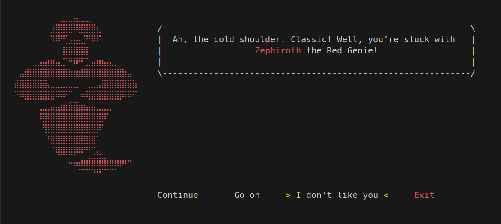

# Console Adventure

<span style="color:Yellow">Console</span> <span style="color:Green">Adventure</span> is a terminal fantasy game. Where 
the player wanders through the Magical Lands fighting enemies, getting gear and .
It was designed using oop the only node package is readline-sync. It is a fantasy turn based game that 

# Requirements

1. ***[Node.js](https://nodejs.org/pt)*** (tested on 20.17.0 but should work anywhere)
2. ***readline-sync*** package. use npm on the game directory to install: (1.4.10 is already on this repo)
```shell
npm install readline-sync
```

# Running the Game
To run the game simply make sure you have node.js installed in your system, you can check by opening a terminal and running:

```shell
node --version
``` 

Then just download or clone this repo and change the folder to the game's folder:
```shell
cd ConsoleAdventure
```
and run main.js with node
```shell
node main.js
```

# Future Features

Some features that are still not implemented but are coming soon:
1. Save and load Game
2. Xterm.js compatibility
3. Story mode: Right now the only game mode available is Gauntlet Mode (no choice auto goes into it in the new game) but a story mode is coming soon
4. Maps: players will be set in a location and will be able to choose where to go, see where they are etc.
5. Final boss: class that will be part of the story mode.
6. Async Support -> Game was developed with the sync package but it should not be. With Async support, player should be able to also use Arrow Keys on windows and use enter instead of space.
7. Dynamic resize support -> right now, ```process.stdout.columns``` gets the columns of the terminal at the beginnig of the process.

# Preview

### 5 Mysterious Genies


### 3 Classes


### And a lot of Adventure!


